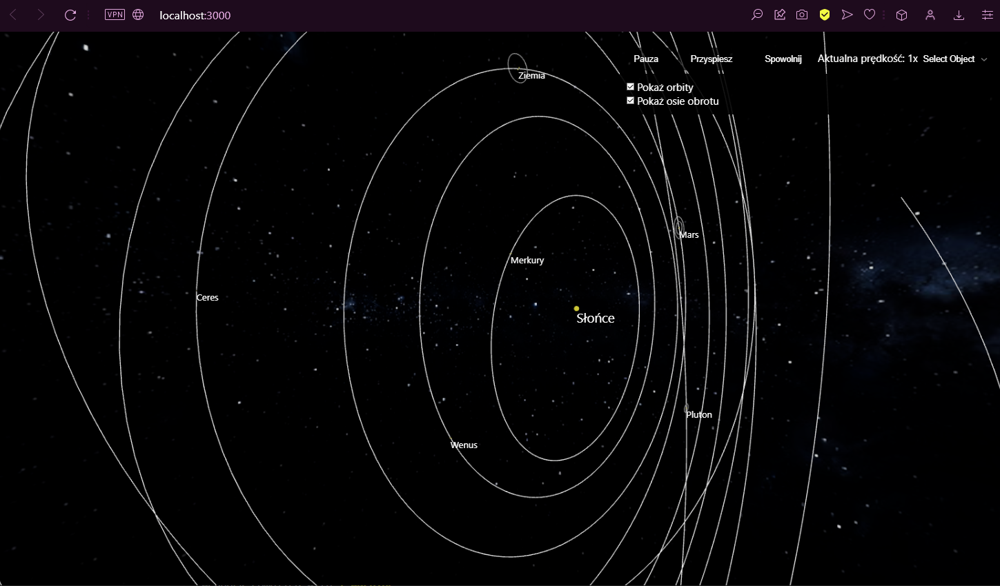

# Solar System Simulation Project

## Overview
This project is a simulation of the Solar System, including the Sun, planets, dwarf planets, moons of planets, and their orbits. It is built using React and Three.js.

## Features
- **Free Navigation**: You can freely navigate through the solar system.
- **Orbital Camera Mode**: The camera can enter an orbital mode around any object.
- **Orbit Display**: The orbits of the objects can be displayed.
- **Rotation Axis Display**: The rotation axis of each object can be shown.
- **Time Control**: The simulation time can be paused, sped up, or slowed down.

## Technologies Used
- **React**: A JavaScript library for building user interfaces.
- **Three.js**: A cross-browser JavaScript library used to create and display animated 3D computer graphics in a web browser.

### Image

